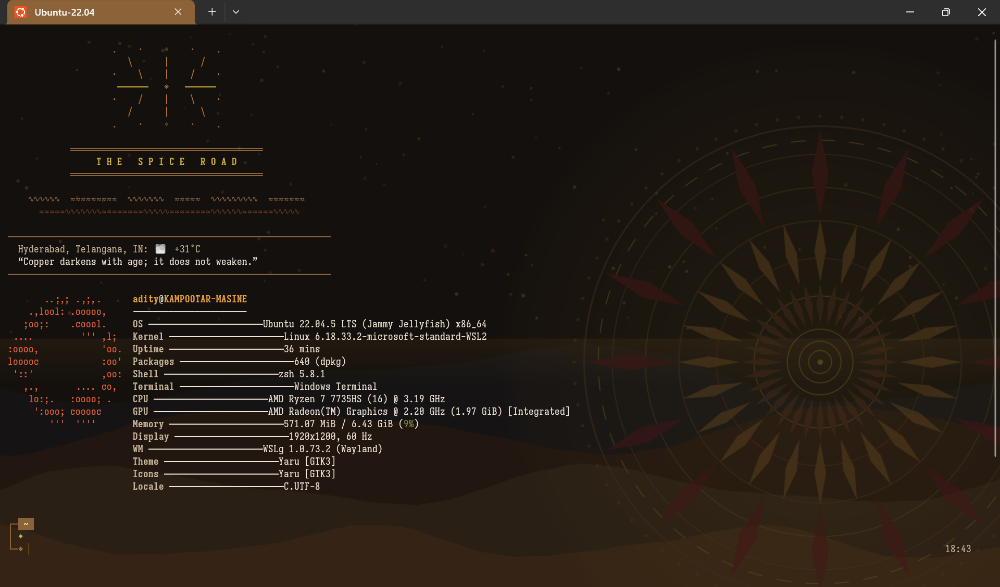
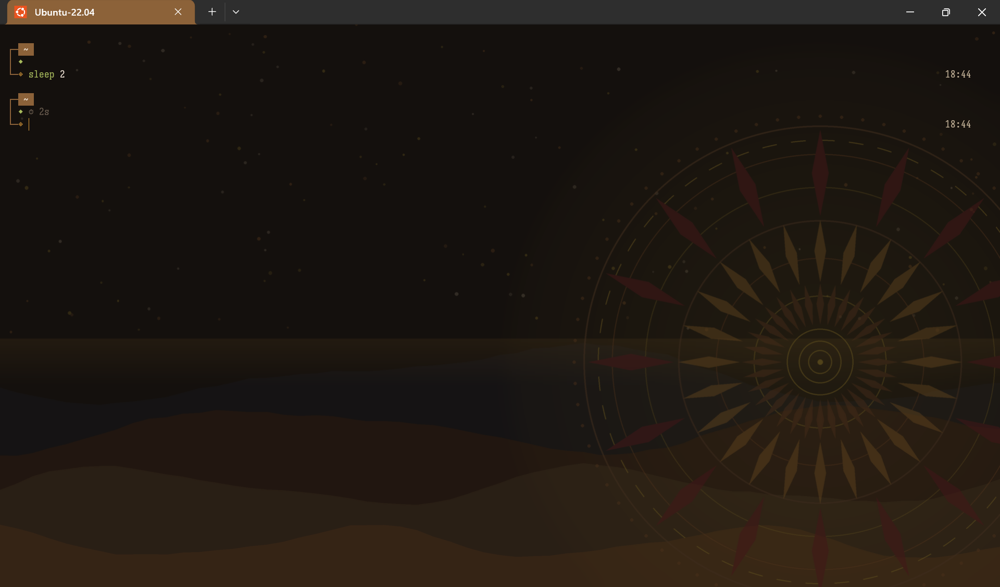
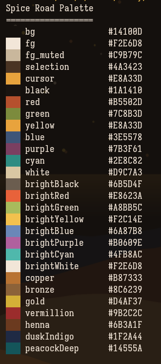

# ◈ The Spice Road ◈

_A full-cockpit terminal theme for WSL2 & Windows Terminal — Dune + Indian Subculture inspired_

[](LICENSE)
[](https://github.com/adityajha1606/spice-road/stargazers)
[](https://github.com/adityajha1606/spice-road/commits)
[](#)
[](#)
[](#)
[](#)
[](#)

The Spice Road is a full‑cockpit terminal theme — a three‑row Starship dashboard, a hand‑built boot sequence, and a 28‑color palette that reaches from your ls listing to your Windows Terminal background, all pulled from one file so nothing clashes by accident.

---

## First Sight


_The full boot sequence — everything below happens before you type a single command._


_What's left once the banner's done its job._


_The palette that everything else is built from._

_A GIF walkthrough is coming soon._

<!-- placeholder: screenshots/demo.gif -->

If this is the kind of thing you'd want waiting for you every time you open a terminal, ⭐ starring the repo helps more people stumble onto it.

---

## Quick Start

```bash
git clone https://github.com/adityajha1606/spice-road.git
cd spice-road
```

From here, `SETUP-GUIDE.md` walks through the rest — a manual install, start to finish, for WSL2 and Windows Terminal. Budget about 30 minutes. An automated installer is on the roadmap, but for now it's hands-on, on purpose.

---

## Inside the Cockpit

- **Palette** — `palette.py`: 28 named colors (marigold, vermillion, bronze, copper, gold, indigo, desert moss, parchment, and more), the single source every other file pulls from.
- **Prompt engine** — Starship, configured in `starship.toml` as a three-row dashboard. Every module gets its own foreground and background; no two share an accent.
- **Shell** — Zsh on oh-my-zsh, with zsh-autosuggestions, zsh-completions, fzf-tab, and zsh-syntax-highlighting. fzf, zoxide, eza, and bat handle search, navigation, listing, and previews. LS_COLORS is hand-built from the palette.
- **Welcome banner** — Hand-drawn ASCII/Unicode art, not figlet: a sunburst medallion, dune-wave dividers, the title typed out letter by letter. Weather comes from wttr.in, cached for 25 minutes and run in the background so it never holds up your prompt. An ever-rotating line of original desert-bazaar aphorisms greets you on new tabs. fastfetch handles the system stats.
- **Battery Module** — WSL2-compatible, with a background refresh that won't slow your prompt down.
- **fastfetch** — Two configs: `-full` for daily use, `-safe` for screenshots and streams.
- **Windows Terminal** — A matching color scheme, Iosevka TermSlab NF, bar cursor, tuned padding, a procedurally generated background at low opacity, and a bronze tab color.
- **Background image** — Generated, not drawn: `generate_background.py` builds a mandala-and-dune-horizon scene; Windows Terminal controls the opacity on top of it.
- _Optional_ **Tmux** — `tmux-spice-road.conf` mirrors the status bar styling in true color, for anyone who lives in panes.
- **Utilities** — `preview-colors.sh` prints the full palette as swatches; a pre-commit hook lints shell scripts before they land.
- **Docs** — `PLAN.md`, `SETUP-GUIDE.md`, `DESIGN.md`, `CUSTOMIZE.md`: the blueprint, the manual, the manifesto, and the how-to-make-it-yours guide.

---

## Why It Looks Like This

The Spice Road runs on a fusion — roughly 60% Dune, 40% Rajasthani and Indian folk maximalism. The Dune half shows up as scale: vast distances, spice, bronze machinery, the haze a mirage throws over the horizon. The other 40% shows up as density and warmth: marigold garlands, brass, temple tilework, the crowded color of a bazaar. Neither half sits on top of the other as decoration — they're built into the same 28-color palette, so a single hex can read as desert dust in one module and temple brass in the next.

> Every color is intentional. No two modules share an accent.

That's the whole rule, and it's why the prompt is three rows instead of one line, and why there's a full boot sequence before you even get a cursor. `DESIGN.md` has the longer argument, if you want it.

---

## Reading the Instrument Panel

Here's what's actually on screen every time a new shell opens:

```
┌─[ ~/spice-road ]─[ main ✓ ]─[ ⬢ 20.11 ]─[ 🐍 3.11 ]─[ 🐳 default ]──┐
│  jobs 2   mem 42%   cpu 12%   ◆ online   bat 87%   took 340ms        │
└─◈ ────────────────────────────────────────────────────────── 22:14  ┘
```

_Above: what you see every time you open a terminal._

Row 1 (bronze `┌─`) is context — where you are, what branch you're on, which runtime's active, whether Docker or a cloud CLI is in play, plus your hostname over SSH. Row 2 (bronze `│`) is the pulse: background jobs, memory, CPU, whether you're online, battery, how long the last command took, and an exit code if something failed. Row 3 (bronze `└─`) is the prompt character itself — gold on success, red on failure, cyan in vim mode — with the clock sitting right-aligned across from it.

---

## Tech Stack

[](https://starship.rs)
[](#)
[](https://ohmyz.sh)
[](#)
[](#)
[](#)
[](#)
[](#)
[](#)
[](#)
[](#)
[](#)
[](LICENSE)

---

## Installation

**Prerequisites:** WSL2, Ubuntu 22.04, Windows Terminal.

```bash
git clone https://github.com/adityajha1606/spice-road.git
```

From there, `SETUP-GUIDE.md` covers the rest end to end — including fastfetch, which ships as a prebuilt `.deb` in the guide, so there's no source build involved.

---

## Make It Yours

`CUSTOMIZE.md` has the full guide, but three small changes give a sense of how it's wired:

- Change a hex in `palette.py` and watch it ripple through the prompt, the file listing, and the Windows Terminal scheme.
- Add a pill to `starship.toml` for whatever cloud CLI isn't already on the panel.
- Swap `fastfetch-config-safe.jsonc` in for `-full` before a screen share or stream.

---

## Contributing

Fork it, branch it, open a pull request. Shell scripts get linted on commit through `.pre-commit-config.yaml` — install the hook before you push anything. If a change touches the architecture rather than a detail, `PLAN.md` has the reasoning behind the current shape. Worth a read before reshaping it.

---

## The Journey So Far

The repo's new, so this chart doesn't say much yet. That's fine — it's honest.

[](https://star-history.com/#adityajha1606/spice-road&Date)

---

## License

MIT. Full text in [LICENSE](LICENSE).

---

## Thanks Along the Road

None of this exists without the tools doing the actual work underneath it: Starship, fastfetch, oh-my-zsh, eza, bat, zoxide, fzf, and the zsh-autosuggestions, zsh-completions, fzf-tab, and zsh-syntax-highlighting plugins. And, more broadly, the open-source habit of building things and giving them away.

The road's marked. Where you take it from here is yours.

— Made with ❤️ by Aditya Jha
